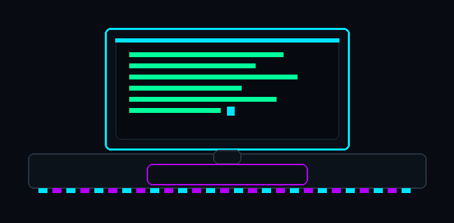

<!--
GitHub Profile README
Usage:
- Put this README.md in a public repo named exactly your GitHub username.
- Add your header GIF at: assets/neon-pixel-coding.gif (or change the path below).
-->

  

  

<h1 align="center">Shubham Raj</h1>

  <a href="https://github.com/ShubhamRaz">github.com/ShubhamRaz</a>

  DevOps • MLOps • ML Engineering • System Building

 

## Bio

- I build and operate production systems: CI/CD, cloud infrastructure, and observability.
- I apply ML where it matters: robust pipelines, monitoring, and reliable deployment.
- I like sharp tooling, clean docs, and automation that eliminates toil.

## Tech Stack

  
  
  
  
  
  
  
  
  
  

## Featured Projects

<!--
Tip: Replace repo=... with your actual repos.
If you want 2 cards instead of 4, delete a row.
-->

  
  

  
  

 

## GitHub Stats

  
  

  

## Activity Graph

  

